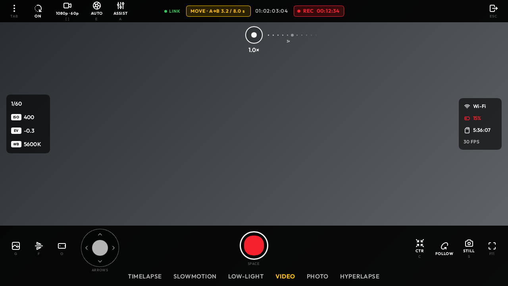
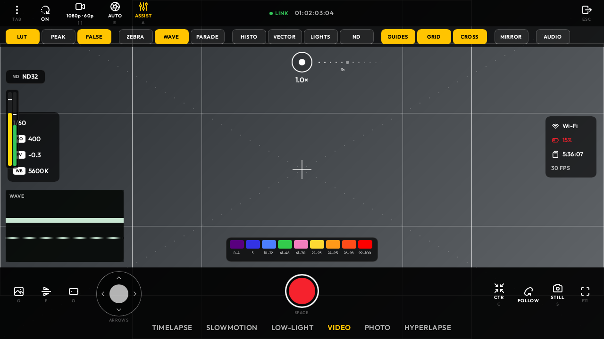
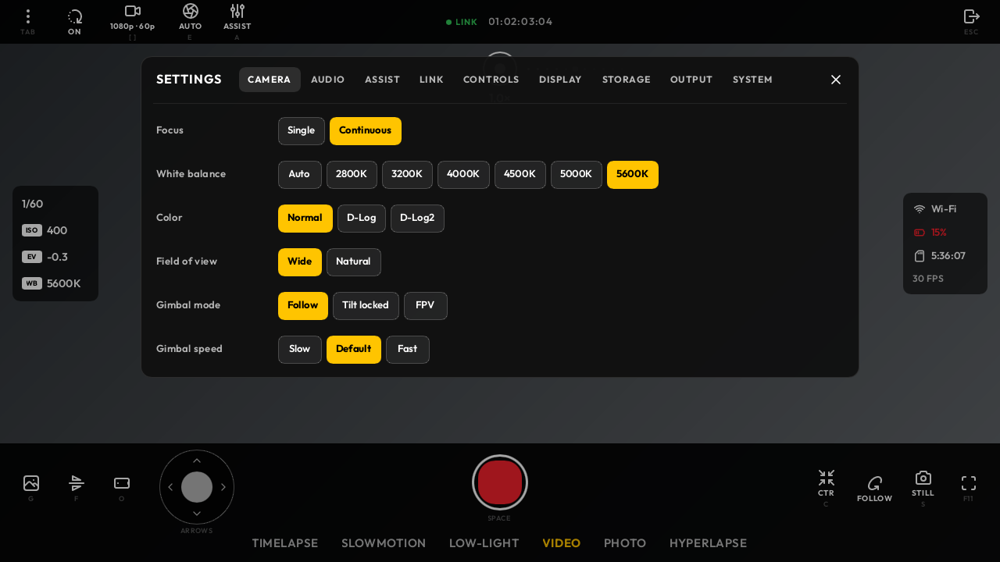
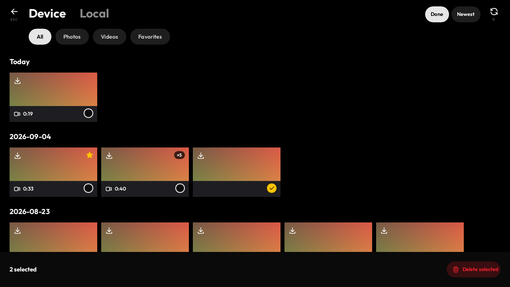

# Pocket Monitor

Pocket Monitor is a Windows-first, open-source field monitor and control surface for DJI Osmo Pocket cameras. It pairs a laptop with the camera, reconnects through the saved camera Wi-Fi profile, and turns the laptop into a live viewfinder with camera controls, monitoring tools, media access, and virtual-camera output.

It is designed for operators who want a larger, keyboard- and controller-friendly monitor without depending on a phone once the camera has been paired.

<p align="center">
  
</p>

| Monitoring assists | Camera settings |
| --- | --- |
|  |  |
| **Media library** | **Desktop operator surface** |
|  | Recording, gimbal, zoom, assists, settings, and playback stay in one Windows-native workflow. |

_Screenshots use the built-in offline demo renderer and contain no camera footage._

> **Independent project.** Pocket Monitor is not made by, affiliated with, or endorsed by DJI. It talks to the camera through independently implemented protocol code; it does not bundle a DJI SDK.

## What works today

The desktop app is actively being tested against an Osmo Pocket 3. Features marked **in validation** are implemented but still need longer physical-camera soak testing before they should be trusted on a paid shoot.

| Area | Desktop capability | Status |
| --- | --- | --- |
| Connection | First-pair Bluetooth flow, camera Wi-Fi credential handoff, saved Windows Wi-Fi reconnect; or the camera on your own Wi-Fi, found there at every launch | In validation |
| Live view | Direct camera feed, AVC/H.264 decode, GPU presentation, feed watchdog and recovery diagnostics | In validation |
| Record controls | Start/stop, 3-second countdown, still capture, record-state feedback | Available |
| Gimbal and lens | Pan/tilt, diagonal motion, recenter, selfie flip, zoom, gimbal-mode switching | Available |
| Subject control | Draw-to-track, stop tracking, tracking subject/status label | Available |
| Camera settings | Exposure controls and video resolution/frame-rate stepping | Available |
| Monitoring | Zebra, focus peaking, colour cube, mirror, fullscreen/hidden chrome | Available |
| Media | Camera gallery and local playback surface | Available |
| Production integration | Virtual-camera output for compatible video applications | In validation |
| Input | Keyboard controls and game-controller support | Available |
| Diagnostics | Persistent `opc-monitor.log`, link/ACK/video-rate samples, decoder and watchdog events | Available |

### Keyboard controls

| Key | Action | Key | Action |
| --- | --- | --- | --- |
| `Space` / `R` | Start / stop recording | `S` | Capture still |
| Arrow keys | Pan and tilt; combine for diagonal movement | `C` | Recenter gimbal |
| `+` / `-` | Zoom | `0` | Return to wide |
| `F` | Switch selfie direction | `V` | Cycle gimbal mode |
| Drag | Draw a tracking target | `X` | Stop tracking |
| `[` / `]` | Step resolution / frame rate | `G` | Open gallery |
| `Z`, `P`, `L`, `M` | Zebra, peaking, colour cube, mirror | `H` | Hide chrome |
| `Esc` | Close the viewfinder | | |

## DJI Mimo comparison

DJI Mimo remains DJI's official mobile companion and is the right choice for firmware updates, activation, and the broadest supported camera workflow. Pocket Monitor is not a replacement claim or a certification statement. The table describes our intended operator experience relative to Mimo, not official feature parity.

| Workflow | Pocket Monitor desktop | DJI Mimo comparison |
| --- | --- | --- |
| Connect and live view | Laptop-first: saved Wi-Fi reconnect and a dedicated connection screen | Similar core purpose; Mimo is the official supported app |
| Framing and motion | Keyboard, controller, mouse/touch tracking, large display | Adds desktop-oriented controls beyond a phone interface |
| Monitoring | Scope/assist overlay surface and fullscreen operator chrome | Focused on laptop field-monitor use |
| Recording and settings | Direct record, still, gimbal/lens controls, selected video/exposure settings | Deliberately smaller than Mimo's full camera-management surface |
| Media and sharing | On-camera media access and desktop playback | Does not aim to duplicate Mimo's mobile sharing/editing ecosystem |
| Firmware, activation, account services | Not provided | Use DJI Mimo |
| Support and reliability | Community project; direct camera protocol still under active physical validation | DJI-supported workflow |

### Why use it

- A real laptop viewfinder: more screen space, keyboard shortcuts, controller input, and a production-oriented HUD.
- Local-first operation: after first pairing, Windows can reconnect directly to the camera's saved Wi-Fi profile.
- Virtual-camera integration for compatible desktop video tools.
- No subscription, ads, or account requirement from Pocket Monitor itself.

### Trade-offs and limitations

- It is reverse engineered and still being hardened. Verify recording state on the camera body until you have proven it for your setup.
- Camera Wi-Fi usually replaces the laptop's internet connection while monitoring.
- Windows and the directly tested Pocket workflow are the current focus; model and firmware coverage is not universal.
- Firmware updates, activation, DJI account features, and official support belong in DJI Mimo.
- A live feed can still expose decoder, Wi-Fi, GPU-driver, or camera-firmware issues. Keep `opc-monitor.log` when reporting a problem.

## Quick start on Windows

For normal use, download the installer or portable ZIP from the [latest GitHub release](https://github.com/fav-devs/Pocket-Monitor/releases/latest). Releases are currently unsigned, so Windows may show a SmartScreen warning; verify the published SHA-256 checksum before running them.

### 1. Install prerequisites

Use Windows 10/11 with a Vulkan-capable GPU and current graphics drivers. For a source build, install:

- the Swift toolchain for Windows (the project build scripts locate a normal `winget` Swift installation);
- Rust stable with the MSVC target;
- Visual Studio 2022 Build Tools with **Desktop development with C++** and a Windows SDK;
- FFmpeg shared libraries available to the build/runtime; and
- the Vulkan SDK, including shader tools.

The app is Windows-first. `just desktop-check` is useful for core/Rust validation on other development hosts, but the operator build and camera workflow are validated on Windows.

### 2. Build

From the repository root:

```powershell
# Debug build: terminal and richer diagnostics
.\Apps\Desktop\build-debug.ps1 -StopRunning

# Operator build: terminal-free executable with diagnostics written to opc-monitor.log
.\Apps\Desktop\build-release.ps1 -StopRunning
```

The release executable is staged at:

```text
Apps\Desktop\target\release\opc-monitor.exe
```

`-StopRunning` closes an already-running local monitor process before rebuilding, so Windows does not hold the executable or DLL open.

### 3. Pair and reconnect

1. Turn on the Pocket camera.
2. Start `opc-monitor.exe`. The connection window is the normal launch surface.
3. On first use, complete the Bluetooth pairing request and allow the app to join the camera Wi-Fi network.
4. Windows saves that Wi-Fi profile. Future launches use the saved profile first, so ordinary reconnect is Wi-Fi-only.
5. When the HUD opens, wait for the feed state to become live before relying on the monitor.

If the camera password changes, Windows has forgotten the profile, or the camera subnet cannot be obtained, use **Pair again** from the connection window. Use **Cancel** to stop the connection attempt without waiting through a long Windows network timeout.

### 4. Diagnose a failed or frozen feed

The release app deliberately has no terminal window. Its log is beside the executable:

```text
Apps\Desktop\target\release\opc-monitor.log
```

For a useful report, reproduce the issue for 30–60 seconds, close the app, and attach that log with the camera model, camera firmware version, Windows version, GPU, and whether the laptop was already joined to the camera Wi-Fi. The log records link ACK cadence, packet/access-unit progress, decoder failures, last-video age, and watchdog recovery.

## Repository layout

| Path | Purpose |
| --- | --- |
| [`Apps/Desktop/`](Apps/Desktop/) | Windows desktop workspace, build scripts, UI, renderer, camera link, and media crates |
| [`Sources/OpenPocketViewCore/`](Sources/OpenPocketViewCore/) | Portable Swift protocol and camera business logic |
| [`Sources/OpenPocketCineDesktopFacade/`](Sources/OpenPocketCineDesktopFacade/) | Swift C ABI used by the Rust desktop shell |
| [`Sources/COpcDesktop/`](Sources/COpcDesktop/) | Shared C records for Rust and Swift |
| [`Tests/`](Tests/) | Swift core and desktop-facade tests |
| [`docs/`](docs/) | Desktop architecture, live-session, performance, and operator references |

Useful verification commands:

```powershell
swift test
just desktop-check
```

## Contributing and protocol research

Contributions are welcome, especially Windows GPU coverage, camera/firmware compatibility reports, repeatable live-session captures, tests, documentation, and small focused fixes. Please read [CONTRIBUTING.md](CONTRIBUTING.md) and the repository's [desktop instructions](AGENTS.md) before opening a pull request. Never commit camera Wi-Fi passwords, captures, or personally identifying logs.

### Attribution and original research material

Pocket Monitor began as a desktop-focused continuation of [OpenPocketCine](https://github.com/erik-sutton95/OpenPocketCine). Thank you to its original creator, [Erik Sutton](https://github.com/erik-sutton95), and to every contributor to that project for the foundation, research, and open-source work that made this direction possible.

The initial understanding of the Osmo Bluetooth pairing and camera Wi-Fi connection path was informed by [Osmosis](https://github.com/KonradIT/osmosis), the open Android client by Konrad Iturbe. Pocket Monitor is an independent implementation; Osmosis is acknowledged as research and inspiration, not copied source code.

Camera behavior is also validated against real hardware and captured protocol observations. Please preserve this attribution in derivative protocol documentation, link to the relevant public source or reproducible observation, and do not add proprietary DJI materials, camera passwords, or redistributable vendor assets to this repository.

## License and trademarks

Pocket Monitor is licensed under [Apache-2.0](LICENSE). “DJI,” “Osmo,” “Osmo Pocket,” and “Mimo” are trademarks of SZ DJI Technology Co., Ltd.; they are used only to identify compatible products and comparison workflows.
